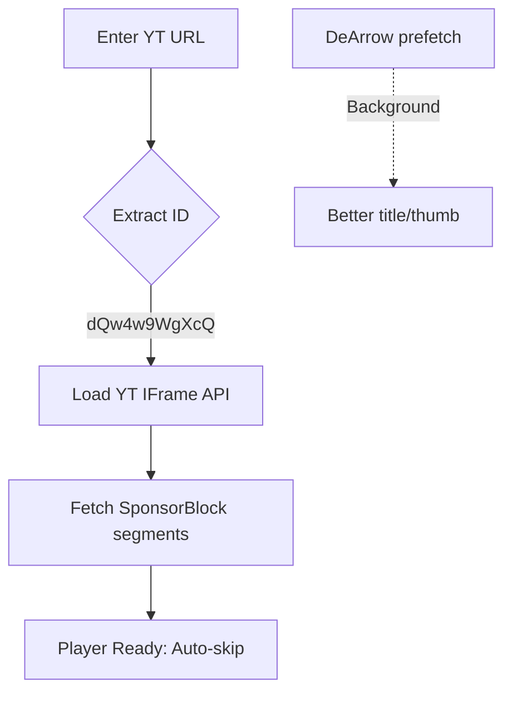

# LibreWatch
**Privacy-focused YouTube player** with SponsorBlock auto-skipping, DeArrow metadata replacement, and Invidious/Piped frontends. Pure vanilla JavaScript - no build tools, no tracking.

## ✨ Features

- ✅ **SponsorBlock** - Auto-skips sponsors, intros, outros, self-promo
- ✅ **DeArrow** - Community-voted titles & thumbnails  
- ✅ **Privacy Frontends** - Invidious + Piped instances (Tor/I2P support)
- ✅ **Smart Caching** - 5min cache, rate limiting, multi-tab sync
- ✅ **No Google Tracking** - Avoids YouTube telemetry
- ✅ **Lightweight** - ~15KB total, GitHub Pages ready

## 🎥 Quick Demo

```html
<!-- Just paste this anywhere -->
<iframe src="https://krynet-llc.github.io/LibreWatch/Frontend/YTFrontend.html" width="640" height="420"></iframe>
```
## 📁 File Structure

```
LibreWatch/
├── Frontend
└── YTFrontend.html      # Main UI
├── Player/
    ├── config.json      # API endpoints & settings
    ├── playerCore.js    # Caching + rate limiting
    ├── youtubePlayer.js # YT IFrame + SponsorBlock
    └── extract.js       # Video ID parser
```

## 🚀 Getting Started

1. **Fork & Deploy**
   ```bash
   git clone YOUR_REPO
   # Upload to GitHub Pages/Netlify/Vercel
   ```

2. **Test it**
   ```
   https://yourusername.github.io/LibreWatch/
   ```

3. **Customize** `Player/config.json`
   ```json
   {
     "Player": {
       "UI": { "Invidious": { "NerdVPN": "https://invidious.nerdvpn.de/" } },
       "Misc": {
         "sponsorBlock": { "API": "https://sponsor.ajay.app/" },
         "dearrow": { "API": "https://dearrow.ajay.app/", "KEY": "FR3Lo-e986a" }
       }
     }
   }
   ```

## ⚙️ Configuration

| Service | Config Path | Default |
|---------|-------------|---------|
| **SponsorBlock** | `Player.Misc.sponsorBlock.API` | `sponsor.ajay.app` |
| **DeArrow** | `Player.Misc.dearrow.KEY` | `FR3Lo-e986a` |
| **Invidious** | `Player.UI.Invidious.NerdVPN` | `invidious.nerdvpn.de` |
| **Piped** | `Player.UI.Piped.Piped` | `piped.video` |

**Rate Limits** (built-in):
- 25 req/min across APIs
- 5min cache (80 entries)
- 4s cooldown per video

## 🛠 How It Works



1. **Extracts** video ID from any YouTube URL
2. **Creates** YT player with `modestbranding=1&rel=0`
3. **Fetches** SponsorBlock segments on `onReady`
4. **Polls** every 300ms, auto-seeks past segments
5. **Caches** API responses (5min TTL)

## 🌐 Privacy Frontends

| Network | Instance | URL |
|---------|----------|-----|
| Clearnet | NerdVPN | `invidious.nerdvpn.de` |
| Tor | NerdVPN | `nerdvpneaggggfdi...onion` |
| I2P | Nadeko | `nadekoohummkxncch...b32.i2p` |
| Piped | Official | `piped.video` |

## 📱 Browser Support

| Browser | Version | Status |
|---------|---------|--------|
| Chrome | 76+ | ✅ |
| Firefox | 65+ | ✅ |
| Safari | 13+ | ✅ |
| Mobile | Latest | ✅ |

## 🔧 Development

```bash
# Serve locally
npx serve .

# Edit config.json for custom APIs
# Reload page - config hot-reloads
```

**No build step needed** - edit & refresh.

## 🤝 Contributing

1. Fork repo
2. Add your Invidious/Piped instance to `config.json`
3. PR with ✅ working tests
4. Follow 80-char lines, 2-space indent

**Good first issues**: More frontends, CORS proxies, theming.

## 📄 License

AGPL 3.0 © 2026 - Use freely, no warranty.

***

<div align="center">

**⭐ Star if privacy matters**  
**🐛 [Issues](https://github.com/YOUR_USERNAME/LibreWatch/issues)** | **💬 [Discussions](https://github.com/YOUR_USERNAME/LibreWatch/discussions)**

</div>
